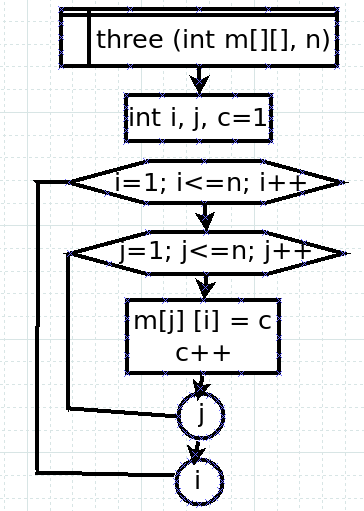
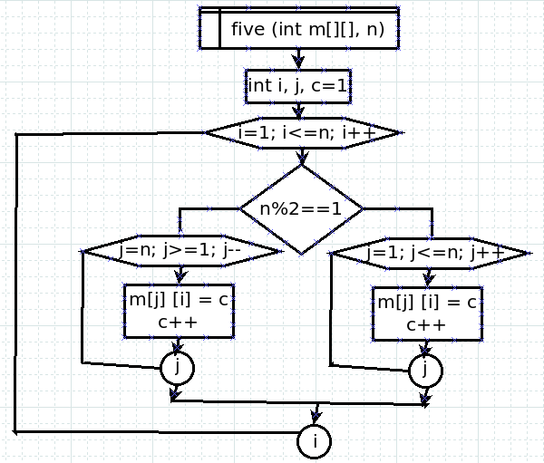
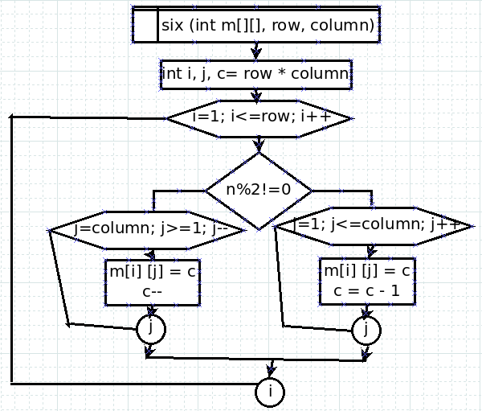
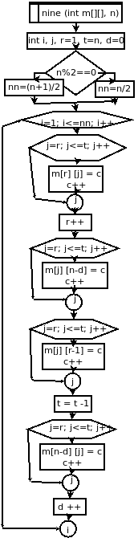

# Proyecto de Programación Orientada a Objetos en Java

Este proyecto tiene como objetivo brindar práctica y experiencia en Programación Orientada a Objetos (POO), focalizándose en sus cuatro pilares fundamentales: **abstracción, encapsulamiento, herencia y polimorfismo**. Además, resalta la importancia del desarrollo de la lógica de programación y la implementación de diagramas de flujo.

## Contenido del Proyecto

El proyecto comprende la resolución de 10 ejercicios, cada uno diseñado para abordar diversos aspectos de la POO. Cada ejercicio representa un desafío incremental, promoviendo el análisis, diseño y codificación de soluciones eficientes.

## Estructura del Proyecto

- **`matrices`**: Contiene el código fuente de los ejercicios relacionados con matrices.
- **`FunctionMethods`**: Contiene métodos de funciones comunes utilizados en los ejercicios.
- **`Main`**: Contiene el programa principal.
- **`Diagramas_Flujo`**: Muestra 4 ejercicios al azar con sus respectivos diagramas de flujo.

## Requisitos

- Java JDK (versión recomendada: 17)

## Instrucciones de Ejecución

1. Clona el repositorio:```bash
git clone https://github.com/migayalach/Exercise-Matrix-Java-OOP.git
2. Abre el proyecto en tu entorno de desarrollo preferido.
3. Ejecuta el archivo `Main.java` ubicado en el paquete `matrices`.

*Espero que este proyecto sea beneficioso para aquellos programadores que están dando sus primeros pasos al igual que yo en Java y desean fortalecer sus habilidades en POO y lógica de programación.*

EJERCICIO 3<br><br>
<br><br>

EJERCICIO 5<br><br>
<br><br>

EJERCICIO 6<br><br>
<br><br>

EJERCICIO 9<br><br>
<br><br>
